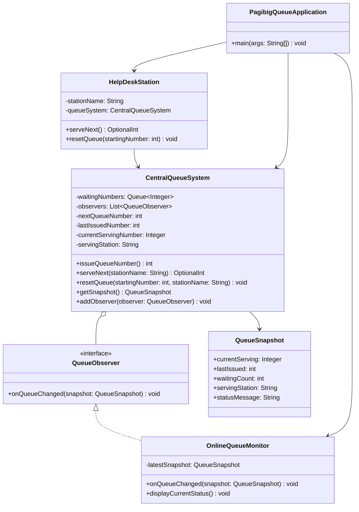

# UML Class Diagram

```mermaid
classDiagram
    class QueueObserver {
        <<interface>>
        +onQueueChanged(snapshot: QueueSnapshot) void
    }
    class QueueSnapshot {
        +currentServing: Integer
        +lastIssued: int
        +waitingCount: int
        +servingStation: String
        +statusMessage: String
    }
    class CentralQueueSystem {
        -waitingNumbers: Queue~Integer~
        -observers: List~QueueObserver~
        -nextQueueNumber: int
        -lastIssuedNumber: int
        -currentServingNumber: Integer
        -servingStation: String
        +issueQueueNumber() int
        +serveNext(stationName: String) OptionalInt
        +resetQueue(startingNumber: int, stationName: String) void
        +getSnapshot() QueueSnapshot
        +addObserver(observer: QueueObserver) void
    }
    class HelpDeskStation {
        -stationName: String
        -queueSystem: CentralQueueSystem
        +serveNext() OptionalInt
        +resetQueue(startingNumber: int) void
    }
    class OnlineQueueMonitor {
        -latestSnapshot: QueueSnapshot
        +onQueueChanged(snapshot: QueueSnapshot) void
        +displayCurrentStatus() void
    }
    class PagibigQueueApplication {
        +main(args: String[]) void
    }

    QueueObserver <|.. OnlineQueueMonitor
    CentralQueueSystem o-- QueueObserver
    CentralQueueSystem --> QueueSnapshot
    HelpDeskStation --> CentralQueueSystem
    PagibigQueueApplication --> CentralQueueSystem
    PagibigQueueApplication --> HelpDeskStation
    PagibigQueueApplication --> OnlineQueueMonitor
```

